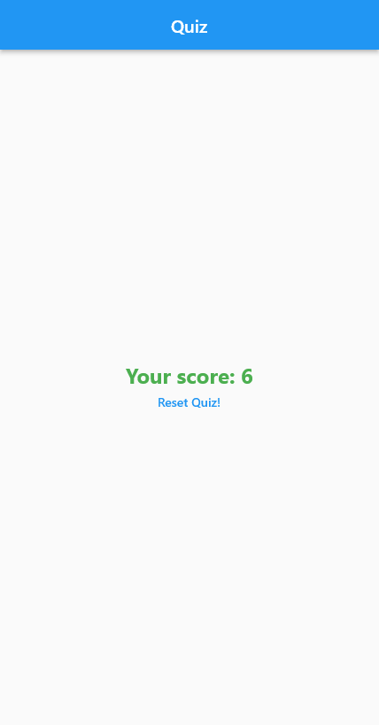

# Quiz App Demo

## Knowledges:

## App Demo:

<<<<<<< HEAD
<<<<<<< HEAD
<<<<<<< HEAD
 [Result Screen](quiz_screen.png)
=======
<<<<<<< HEAD
 
=======
  
>>>>>>> 6d904e76b38956a7cd3bb93dd22e63c641d9c0e3
=======
 
>>>>>>> quiz_demo_app

>>>>>>> quiz_demo_app
=======
 

>>>>>>> quiz_demo_app

